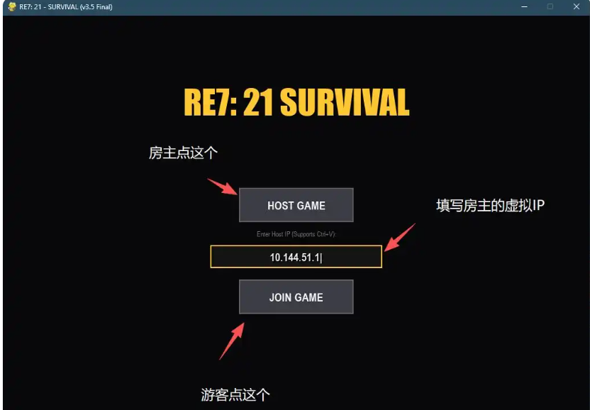
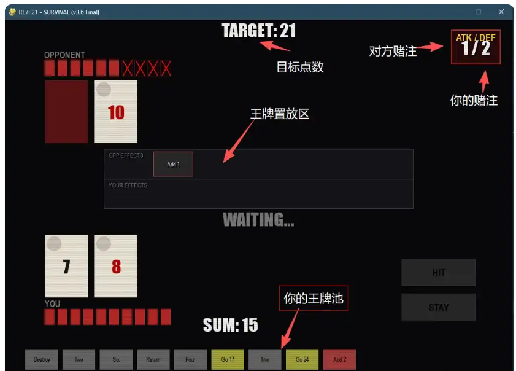
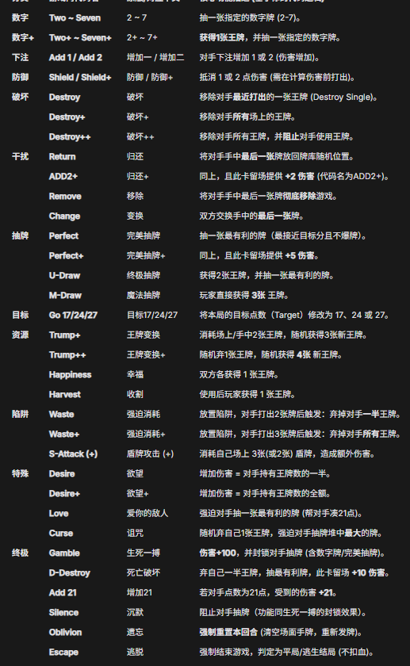

# 生化危机7 21点联机版

## 游戏介绍
- 生化危机7DLC21点的联机版本，通过组网工具实现联机，外置配置文件，支持自定义参数

- 支持自定义参数：初始血量，开局王牌数，回合奖励王牌数目，全部王牌的概率权重，每次HIT抽到王牌的概率，手牌上限，牌桌上王牌数目限制，游戏目标点数等

## 前置条件
- 仓库内下载的exe文件（RE7_21_UE）与配置文件（config.json）

- 组网工具（推荐easytier）[相关使用教程](https://www.xiaoheihe.cn/app/bbs/link/152082955)

## 注意事项

### 下载

- 在release里下载zip，zip内含有exe文件，json配置文件，和王牌中英对照表

- 杀毒软件对这种exe文件可能会报毒，添加信任即可。

### 配置文件
- 请将config.json配置文件与exe置于同一目录下

- exe文件只会读取config.json一个文件，配置文件提供详细注释，也可以直接复制粘贴丢给AI说出需求生成自己自己想要的配置文件。

- 配置文件config.json默认为基础版，仓库内提供类如 “基础版”“混沌版”的json文件为配置预设文件，直接复制粘贴到config.json文件内即可生效。

- 同一目录下没有配置文件，exe会采用参数

- 只有房主的配置文件会生效

## 游戏内截图

> 温馨提示：房主和游客的虚拟IP名不能相同

## 卡牌中英对照表

## 最后
该游戏代码完全由Gemini3.0pro生成，是本人vibe coding的一次小小尝试，主要耗时在添加数量庞大的功能卡牌和对游戏进行调试。由于本人没啥朋友游玩测试时间有限，所以难免会出现BUG，如果有请及时提交，我会在看到后的第一时间修复。
